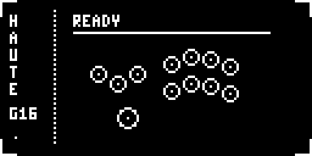
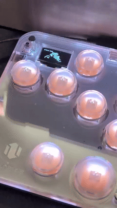
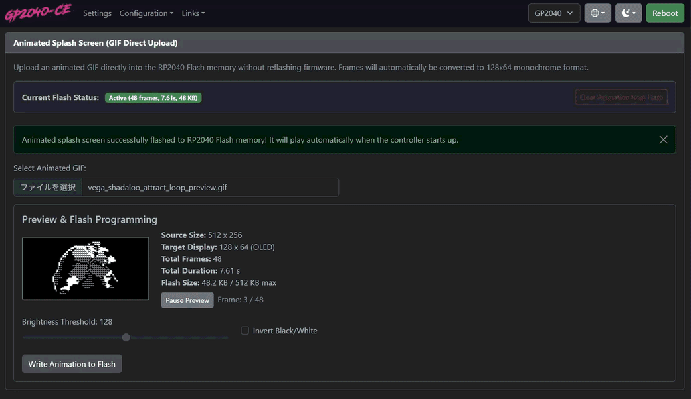
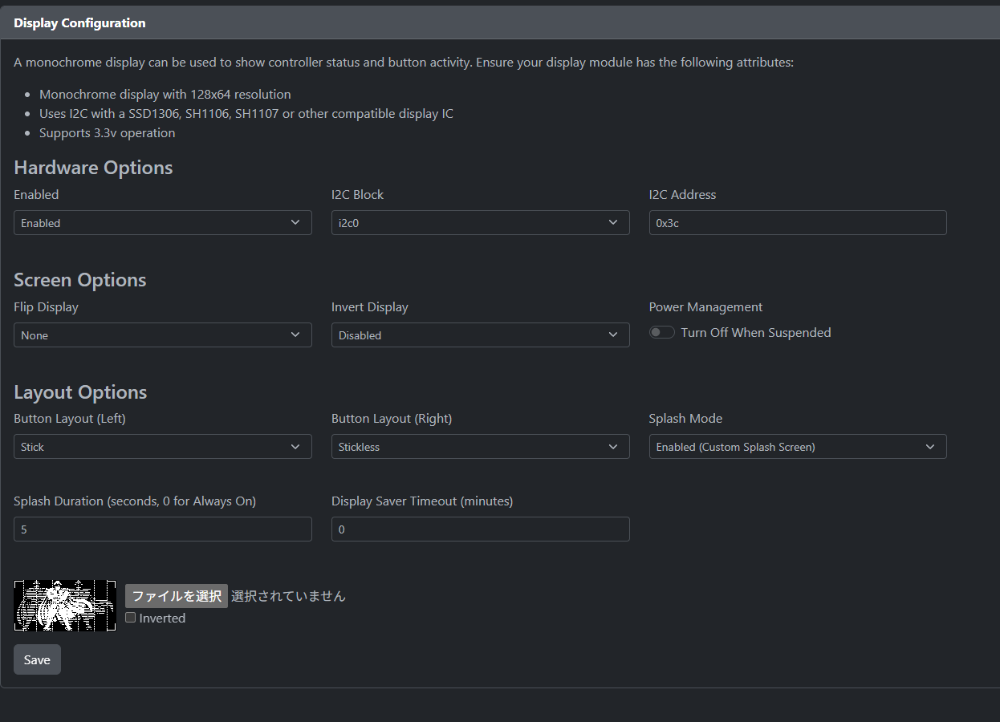

# Haute42 Animated Splash Screen for GP2040-CE

[English](#english) | [日本語](#日本語)

Easily play custom 128x64 animated GIF splash screens on your **Haute42 G16** (and RP2040 OLED controllers) running **GP2040-CE**.  
Once initially installed, **upload, preview, and change animations directly from your web browser without ever touching the BOOTSEL button or re-flashing firmware!**

<p align="center">
  
  <br>
  <em>Pre-packaged Sample: Leverless Hadouken (236+P) Animation (CC0 / Public Domain)</em>
</p>

<p align="center">
  <a href="https://x.com/good_wall/status/2101679788842996177" target="_blank">
    
  </a>
  <br>
  <em>🎬 <strong>Real Hardware Demo / 実機動作デモ:</strong> <a href="https://x.com/good_wall/status/2101679788842996177">Watch on X (Twitter)</a></em>
</p>

---

<a name="english"></a>
## English

### ✨ Features
- **WebConfig Direct Upload**: Upload any animated GIF through your browser (`http://192.168.7.1`) into controller Flash memory.
- **Interactive OLED Simulator**: Real-time 128x64 preview with native GIF frame timings, brightness threshold slider, and black/white inversion.
- **Flash Once, Update in Browser**: Firmware flashing via BOOTSEL is only required once during initial setup. Updating animations afterwards is done 100% through the browser!
- **Infinite Looping Splash**: Plays smooth animated loops continuously without exiting to the button display.
- **Auto-Formatting**: Automatically scales, centers, and binarizes arbitrary GIFs into 128x64 1-bit monochrome.
- **Pre-packaged Sample**: Includes a ready-to-use Hadouken leverless input animation (CC0 / Public Domain).

### 🚀 Quick Start Guide

#### Step 1: Initial Setup (Flash Firmware Once)
You only need to perform this step **once** when first setting up your controller:

1. Download **`haute42_animated_splash_v1.1.0.uf2`** from [GitHub Releases](https://github.com/waaaaall/haute42-animated-splash/releases) (comes with the Hadouken sample animation pre-loaded).
2. Put your controller into **BOOTSEL mode**:
   - **Method 1 (Hardware BOOT Button - Recommended)**: Unplug controller. Hold the small **BOOT button** (or pinhole on the back/side) while plugging the USB cable into your PC.
   - **Method 2 (Button Shortcut)**: While plugged in normally, hold **`Start + X + Y`** (or `Start + Select + Up`) for 5+ seconds until the screen freezes into boot mode.
   - **Method 3 (WebConfig)**: Hold the **START** button while plugging in USB, open `http://192.168.7.1` in your browser, and click **Reboot > Bootsel**.
3. A USB drive named **`RPI-RP2`** will appear on your PC. Drag and drop your `.uf2` file into the `RPI-RP2` drive.
4. The drive will automatically disconnect, and the controller will reboot into the animated splash!

> 💡 *Note: From now on, you never need to repeat Step 1 or enter BOOTSEL mode to change animations!*

#### Step 2: Upload & Update Animations via WebConfig GUI
Whenever you want to change or test a new animation:

<p align="center">
  
  <br>
  <em>Live Demo: Selecting GIF, real-time OLED simulation preview, and direct Flash memory write</em>
</p>

1. Hold the **START** button while plugging the controller into your PC via USB.
2. Open **`http://192.168.7.1`** in any web browser.
3. Navigate to **Configuration** → **Display Configuration**.
4. Scroll down to the **Animated Splash Screen (GIF Direct Upload)** section.
5. Click **Choose File** and select any animated GIF:
   - **Real-Time OLED Simulator**: Simulates the 128x64 display with native GIF frame timings and pause/play controls.
   - **Brightness Threshold Slider**: Fine-tunes monochrome contrast (0–255) with live preview updates.
   - **Invert Black/White**: Inverts pixels for dark-on-light or light-on-dark themes.
   - **Flash Info**: Displays source size, frame count, total duration, and Flash memory usage (up to 512 KB).
6. Click **Write Animation to Flash**. The progress bar will indicate sector erase and chunk upload progress.
7. Replug or restart your controller—your new animation plays immediately upon boot!
   - You can also click **Clear Animation from Flash** anytime to revert to the default static splash screen.

#### Step 3: WebConfig Settings (Display Configuration for Always-On Animation)
If your screen switches to the button layout display (e.g. after 5 seconds) instead of continuously looping the animation, configure these options in WebConfig:

<p align="center">
  
</p>

1. Hold the **START** button while plugging the controller into your PC via USB.
2. Open **`http://192.168.7.1`** in any web browser.
3. Navigate to **Configuration** → **Display Configuration**.
4. Configure the following options:
   - **Hardware Options > Enabled**: `Enabled`
   - **Splash Mode**: **`Enabled (Custom Splash Screen)`**
   - **Splash Duration (seconds, 0 for Always On)**: Set to **`0`**  
     *(⚠️ Critical: Setting this to `0` enables "Always On" mode so the animation loops infinitely and never transitions to the button screen!)*
   - **Display Saver Timeout (minutes)**: Set to **`0`** (prevents screen from turning off)
5. Click **Save** at the bottom of the page and replug your controller.

*(Note: For offline/CLI patching without WebConfig, `patch_splash.py` and `generate_firmware.bat` are also included in the repository.)*

### 🎨 GIF Requirements & Recommendations
- **Resolution**: 128 x 64 pixels (recommended).
- **Color**: Monochrome 1-bit (White on black background recommended).
- **Frames**: Up to 128 frames (16 to 48 frames recommended).
- For details and tips, see [`sample_gif/README.md`](sample_gif/README.md).

### 🕹️ Compatibility & Other RP2040 Controllers

While this repository is pre-configured out-of-the-box for **Haute42 controllers** (G16, B16, T16, S16, etc. using the `Haute42COSMOX` board target), the animated splash engine and WebConfig direct GIF upload feature are **100% board-agnostic** and can be used on **any RP2040-based arcade controller running GP2040-CE**!

#### Requirements:
1. **RP2040 Microcontroller** with at least 2 MB Flash memory.
2. **128 x 64 Monochrome OLED Display** (SSD1306 or SH1106 via I2C or SPI).
   - *(Note: Controllers with 128 x 32 displays will show the top 32 pixels).*
3. **Examples of compatible hardware**:
   - **Flatbox** (Rev 4 / Rev 5 with OLED display addon)
   - **Fightbox** (RP2040 / B1-PC with OLED)
   - **Pico Fighting Board** / **RP2040 Advanced Breakout Board** custom builds
   - **Sallybox**, **BentoBox**, **Mavercade**, etc.
   - DIY controllers based on Raspberry Pi Pico or RP2040 Pro Micro with a 0.96" OLED screen.

#### How to use on another controller:
Different controllers use different GPIO pin assignments for buttons, OLED I2C (SDA/SCL), and LEDs. Therefore, you need a firmware binary built for your specific board target:

1. **Build GP2040-CE with animated splash support**:
   In the GP2040-CE source tree, specify your target board (e.g., `Pico`, `FlatboxRev5`):
   ```bash
   export PICO_BOARD=FlatboxRev5  # Replace with your board target
   cmake -B build -DPICO_BOARD=$PICO_BOARD
   cmake --build build
   ```
2. **Flash the `.uf2` once**: Put your controller into BOOTSEL mode and copy the compiled `.uf2` file.
3. **Enjoy WebConfig Direct Upload**: Once installed, open `http://192.168.7.1` in your browser. The **WebConfig GUI Direct Upload** feature works identically on all supported controllers—no further reflashing required!

---

<a name="日本語"></a>
## 日本語

### 📺 実機デモ
実際の Haute42 G16 でアニメーションが点灯・常時再生されている様子はこちらのポストをご覧ください：  
👉 **[X (Twitter) で実機動画を見る](https://x.com/good_wall/status/2101679788842996177)**

### ✨ 特徴
- **WebConfig GUI からの直接アップロード**: 一度ファームウェアを導入すれば、普段のWebブラウザ（`http://192.168.7.1`）から直接GIFを選択・プレビュー・書き込み可能！BOOTSELモードやファームウェアの再フラッシュは一切不要。
- **リアルタイムOLEDシミュレータ**: 実機同様の128x64ドット表示とフレームレートをブラウザ上で忠実に再現。白黒二値化しきい値や反転もスライダーでリアルタイム調整可能。
- **初回導入のみでずっと使える**: BOOTSELモードでのファームウェア書き込みは最初の1回だけ。日常のアニメーション更新はブラウザだけで完結します。
- **常時ループ再生**: 起動後もボタン入力画面に切り替わらず、滑らかなアニメーションを常時無限ループ再生。
- **可変フレームレート対応**: GIF本来のコマごとのディレイ（緩急）を忠実に再現。
- **自動フォーマット**: 異なるサイズのGIFでも、128x64の中央配置・モノクロ2値化へ自動変換。
- **安心のオリジナルサンプル同梱**: 権利フリー（CC0）な「波動拳コマンド入力アニメーション」を同梱。

### 🚀 クイックスタートガイド

#### Step 1: 初回セットアップ（ファームウェア書き込み：最初の一度だけ）
この作業は **最初の導入時の一度だけ** 行えばOKです：

1. [GitHub Releases](https://github.com/waaaaall/haute42-animated-splash/releases) から **`haute42_animated_splash_v1.1.0.uf2`** をダウンロードします（初期サンプルとして波動拳アニメーションが内蔵されています）。
2. Haute42 を **BOOTSEL モード** で接続します：
   - **方法1（BOOTボタン・推奨）**: USBケーブルを抜いた状態で、背面または側面にある小さな **BOOTボタン**（またはピンホール）を押しながら、PCにUSBケーブルを接続します。
   - **方法2（ボタンショートカット）**: 通常接続した状態で、**`Start + X + Y`**（または `Start + Select + Up`）を5秒以上長押しします。画面がフリーズしてブートモードに入ります。
   - **方法3（WebConfig）**: STARTボタンを押しながらUSB接続し、ブラウザで `http://192.168.7.1` を開いて **「Reboot」→「Bootsel」** を選択します。
3. PCに認識された **`RPI-RP2`** ドライブ直下に、ダウンロードした `.uf2` ファイルをドラッグ＆ドロップ（コピー）します。
4. ドライブが自動切断され、コントローラーが再起動してアニメーションが再生されます！

> 💡 *次回以降、アニメーションを変更する際に BOOTSEL モードやファームウェアの再書き込みを行う必要はありません！*

#### Step 2: WebConfig からアニメーションを更新・登録
アニメーションを差し替えたい時は、いつでもブラウザから簡単に行えます：

<p align="center">
  
  <br>
  <em>実画面デモ: GIF選択、128x64 OLEDリアルタイムプレビュー再生、Flashへの直接書き込み完了まで</em>
</p>

1. **START ボタン** を押しながらコントローラーのUSBケーブルをPCに接続します。
2. ブラウザで **`http://192.168.7.1`** を開きます。
3. **Configuration** → **Display Configuration** に移動します。
4. ページ下部の **Animated Splash Screen (GIF Direct Upload)** セクションへ進みます。
5. **ファイルを選択** でお好きなGIFアニメーションを選択します：
   - **リアルタイムOLEDシミュレータ**: 128x64の表示とフレームディレイを忠実にプレビュー。
   - **Brightness Threshold（二値化しきい値スライダー）**: 白黒の判定しきい値（0〜255）をプレビューを見ながらリアルタイム調整。
   - **Invert Black/White（白黒反転）**: 背景黒・文字白 / 背景白・文字黒をワンクリックで切り替え。
   - **Flash情報表示**: 元画像サイズ、フレーム数、総再生時間、およびFlash使用量（最大512KBまで対応）が自動算出。
6. **Write Animation to Flash** ボタンをクリックします。プログレスバーが進み、Flashメモリへ安全に直接書き込まれます。
7. コントローラーを再接続（または再起動）すると、アップロードしたアニメーションが即座に再生されます！
   - 元に戻したい時は **Clear Animation from Flash** ボタンを押すだけでいつでも初期化できます。

#### Step 3: WebConfig の設定（常時ループ再生）
アニメーションを途中でボタン画面に切り替えず、常時ループ再生させたい場合は以下を設定します：

<p align="center">
  
</p>

1. **STARTボタン** を押しながらPCにUSBケーブルを接続します。
2. Webブラウザで **`http://192.168.7.1`** にアクセスします。
3. メニューの **「Configuration」** → **「Display Configuration」** を開きます。
4. 以下の項目を設定します：
   - **Hardware Options > Enabled**: `Enabled`
   - **Splash Mode**: **`Enabled (Custom Splash Screen)`**
   - **Splash Duration (seconds, 0 for Always On)**: **`0`** に設定  
     *（⚠️ 最重要: ここを `0` にすることで「Always On（常時表示）」となり、ボタン画面に切り替わらずアニメーションがずっとループ再生され続けます）*
   - **Display Saver Timeout (minutes)**: **`0`**（画面が自動消灯するのを防ぐ場合は `0`）
5. ページ下部の **「Save」** ボタンを押し、コントローラーを再接続します。

*(※補足: WebConfig を使わずオフラインで Python スクリプトから一括パッチ適用したい場合は、リポジトリ同梱の `patch_splash.py` / `generate_firmware.bat` も引き続きご利用いただけます。)*

### 🎨 GIFの推奨仕様
- **解像度**: 128 x 64 ピクセル（推奨）。
- **カラー**: モノクロ 2値（黒背景に白描画を推奨）。
- **フレーム数**: 最大 128フレーム（16〜48フレーム程度が最も滑らかで扱いやすいです）。
- 詳細は [`sample_gif/README.md`](sample_gif/README.md) をご覧ください。

### 🕹️ Haute42 以外のコントローラーでの利用について

本リポジトリはデフォルトで **Haute42 シリーズ**（G16 / B16 / T16 / S16 など、`Haute42COSMOX` ターゲット）向けにビルド済みファームウェアを提供していますが、内部の Flash アニメーションエンジンおよび WebConfig 直接アップロード機能は **GP2040-CE 共通のコア機能** として動作します。

#### 動作条件:
1. **Raspberry Pi RP2040 マイコン**（Flashメモリ 2MB以上）を搭載していること。
2. **128×64 ドットのモノクロ OLED ディスプレイ**（SSD1306 / SH1106 など）を搭載・接続していること。
   - ※128×32 画面のコントローラーでは上半分（32px分）が表示されます。
3. **動作対象コントローラーの例**:
   - **Flatbox**（Rev 4 / Rev 5 など OLED 搭載型）
   - **Fightbox**（RP2040 / B1-PC などの OLED 搭載モデル）
   - **Pico Fighting Board** / **RP2040 Advanced Breakout Board** を使った自作アケコン
   - **Sallybox**, **BentoBox**, **Mavercade** などの各種 GP2040-CE 系レバーレス
   - Raspberry Pi Pico や RP2040 Pro Micro に 0.96インチ OLED を接続した自作機全般

#### 他のコントローラーで利用する手順:
コントローラーごとにボタンや OLED（SDA/SCL）の GPIO ピンアサインが異なるため、対象ボード向けのファームウェアを一度ビルドして書き込む必要があります：

1. **対象ボード用にファームウェアをビルドする**:
   GP2040-CE のソースコード（本パッチ適用済み）にて、お使いのコントローラーのボード名（例: `Pico`, `FlatboxRev5` など）を指定してビルドします：
   ```bash
   export PICO_BOARD=FlatboxRev5  # お使いのボード名
   cmake -B build -DPICO_BOARD=$PICO_BOARD
   cmake --build build
   ```
2. **初回フラッシュ**: コントローラーを BOOTSEL モードにして生成された `.uf2` を書き込みます。
3. **WebConfig からの直接アップロードを利用**: ファームウェア導入後は、Haute42 と同様にブラウザ（`http://192.168.7.1`）から直接 GIF アニメーションをアップロード・プレビュー・書き換えが可能です！

---

## ⚠️ Disclaimer / 免責事項
- This project is not officially affiliated with Haute42 or the GP2040-CE project.
- Flashing firmware is done at your own risk. Always ensure you have a backup of your original controller firmware.
- Users are solely responsible for ensuring they hold the necessary rights or permissions for any custom GIF animations they create and flash for personal use.
- 本プロジェクトは Haute42 公式および GP2040-CE 公式とは独立した有志プロジェクトです。
- ファームウェアの書き込みは自己責任で行ってください。必要に応じて元のファームウェアをバックアップしてください。
- ユーザーが独自に導入するアニメーション素材の著作権については、私的使用の範囲を含め利用者の自己責任において管理してください。

---

## 📜 License & Credits
- **Patch Tool & Sample**: Licensed under the [MIT License](LICENSE).
- **Sample Animation (`sample_gif/leverless_hadouken_loop.gif`)**: Dedicated to the public domain under **CC0 1.0**.
- **Base Firmware**: Derived from [GP2040-CE](https://github.com/OpenStickCommunity/GP2040-CE) (MIT License, Copyright (c) 2024 OpenStickCommunity).
